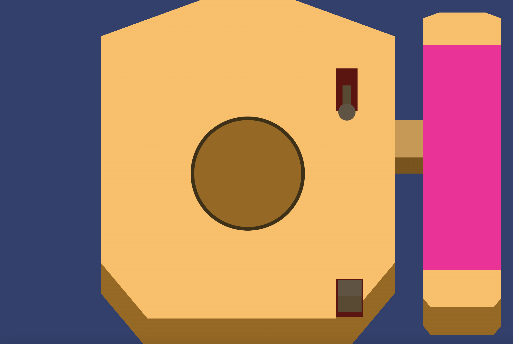

# CSS_ToTheResque_Site
 
<h1> CSS to the Resque</h1>
<h2>verslag</h2>
<h3>week 1</h3>
<h4>main inspiration and why:</h4>

Ikk vind by deze de details en de aankleding heel gaaf, dat het er versleten en oud uitziet, het water in de display en de afgebladderde verf zijn leuke details

Deze foto vind ik vooral voor de layout van interactieve elementen gaaf. Het is heel fijn om een soort van display in het midden te hebben, en de dingen aan de zijkant ziet eruit alsof ze uit kunnen klappen. Leuke opties voor interactie dus!

Deze afbeelding vind ik de aftelcounter heel gaaf, het heeft een doomsday gevoel en de contrast van de ronde sockets en de scherpere letters. Ook de oude casing met het rode licht heeft een hele gave esthetiek

<h4>di 25 februari</h4>

Vandaag begin gemaakt met plannen en het begin van de site. Fotos toevoegen?Volgende keer de machine "aan" kunnen zetten en de volgende interactie beslissen en integreren. Ook verder aan basisopmaak, opzoeken (nep) 3d element

<h4>ma 3 maart</h4>

Vandaag niet veel progressie aan het eindproduct, maar wel meegedaan met workshops en veel in codepennetjes geprobeerd:

glitch effect

hoekjes oefenen

oefenen met 3d transforms

<h4>di 4 maart</h4>

Vandaag heel erg in dubio over welk perspectief ik wil. heb een codepen gemaakt met 3d rotaties, dus ik weet dat het kan en dat IK het kan. Ik weet alleen niet of het stylistish mijn doel is. Ik vind het 'simpele' nep-perspectief er veel gaver uitzien. Sanne heeft me laten zien dat zulke dingen mogleijk zijn met gradient backgrounds, de techniek kende ik al maar het zou niet bij me opgekomen zijn om het zelf op die manier te doen.

<h4>ma 10 maart</h4>

Vandaag interactie gedaan met het uitklappen van een zijpaneel, extra aandacht besteed aan de arm van dat ding waar ik op het moment veel problemen mee heb want het zit over de section heen. Nils heeft geholpen met een mogelijke plossing, maar ik weet niet zeker of die werkt aangezien ik nog dingen op die section wil maken. Heb kleuren toegevoegd die een beetje op metaal lijken voor te knoppen, en het heeft meteen meer geheel dus dat is fijn. Ik heb met ::before en ::after elementen gewerkt en nieuwe dingen ontdekt. Ik heb nieuwe styling en animatie gegeven aan het paneel en aan de positionering ervan.

<h4>di 11 maart</h4>

Vandaag begonnen met het nog een keer nadenken over de haak, en een soort van oplossing gevonden. Advies gekregen om misschien toch naar een echt 3d perspectief te werken, maar dan zonder perspectief. Onderzoeken. Ik weet niet of ik daar genoeg tijd voor heb. Verder sliders gemaakt en die verbonden met een kleurenpuzzel.

slider testing

<h4>Ma 17 en di 18 maart</h4>

Ik heb de kleuren aangepast, wat het meer 1 geheel maakt waar ik blij mee ben. Het is met ook gelukt om de radartjes in elkaar te zetten en te verbinden met de kleuren van de radar, waarbij ik een stukje wiskunde erbij moest doen. Ik vind het best interresant om vanuit de basis van een voorbeeld het compleet te proberen te begrijpen en ik denk nu dat ik alles ervan wel snap. Ik heb een titel met een kleine animatie toegevoegd voor de eisen. Ik weet niet wat ik voor de andere eisen moet/ wil doen aangezien die ook een deeltje structuur vergen. Ik heb even met container queries geprobeerd maar ik denk niet dat het resizing aspect echt nuttig is voor mijn project. Het zelfde is eigenlijk voor style queries en layers, ook al heb ik wel meerdere css bladen zodra de volgorde van die goed zit hoeft die niet veranderd te worden. Ik denk dat ik morgen nog een poging voor cq ga doen als ik meer ruimte heb in mijn hoofd

<h4>wo 19 maart</h4>

Heb uiteindelijk wel een container quiry uit kunnen vogelen op de body. Iets waar ik wel nog in wil duiken is grid-area want die zie ik in tutorials veel langskomen maar ik heb daar nog geen tijd voor gehad/genomen. Ik ben blij met het eindresultaat en ik heb mezelf ook best wel gepushed om nieuwe dingen te leren en te doen.

<!--  -->

<h2> bronnenlijst </h2>

https://blog.logrocket.com/create-fancy-corners-css/ voor rechte hoeken. Nog niet gebruikt maar later miss wel inderessand 25/2/25

bedankt colorpicker for saving my life with the oklch kleuren:https://oklch.com/#74,0.1747,66.18,100

gradient borders

https://www.digitalocean.com/community/tutorials/css-gradient-borders-pure-css?utm_medium=content_acq&utm_source=css-tricks&utm_campaign=&utm_content=awareness_bestsellers

workshop van sanne over hoekjes en borders
https://codepen.io/IKreike/pen/pvoeRem?editors=1100

tips van sanne over gradients over elkaar
https://codepen.io/IKreike/pen/LEYWMLm?editors=0100 

cube tutorial and try-outs

https://3dtransforms.desandro.com/cube

dialtje van sanne:
https://codepen.io/IKreike/pen/yyLPWam?editors=1100

bounce easing
https://easings.net/nl#easeOutBounce

